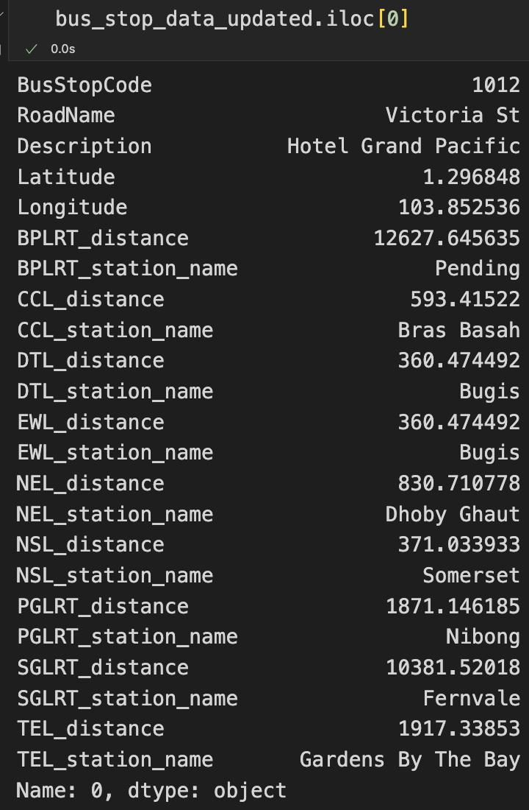
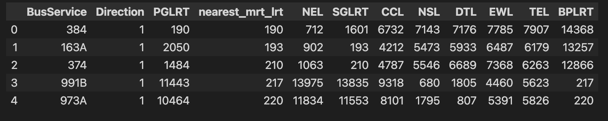
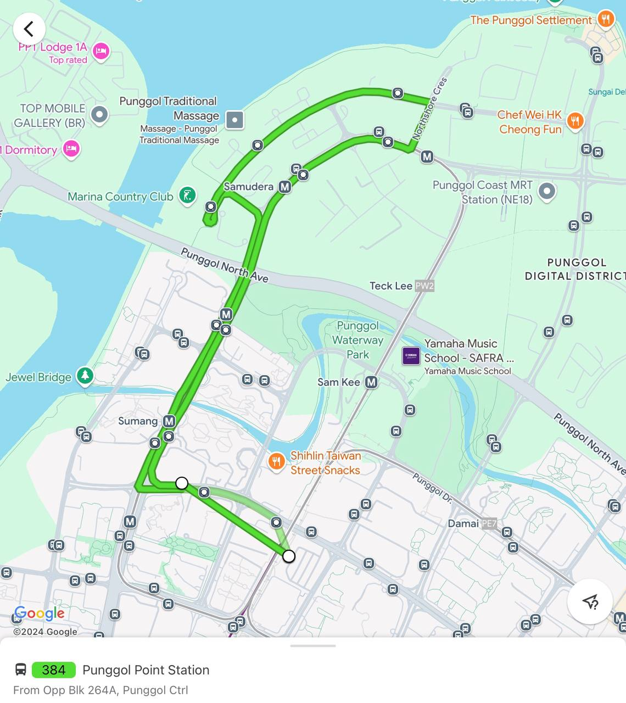
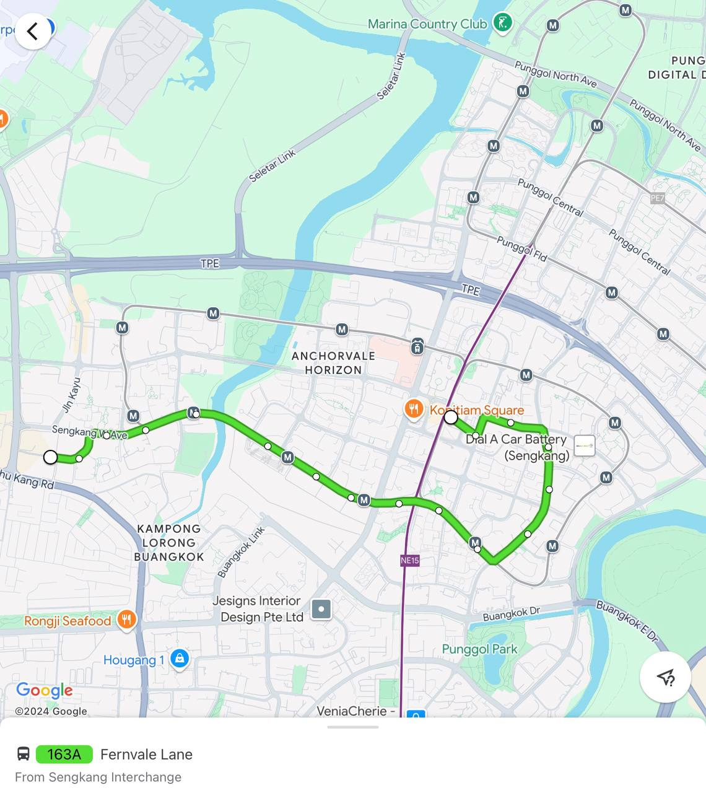
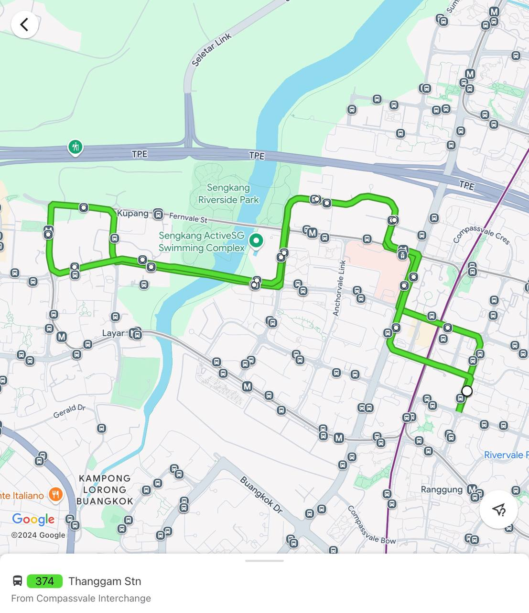
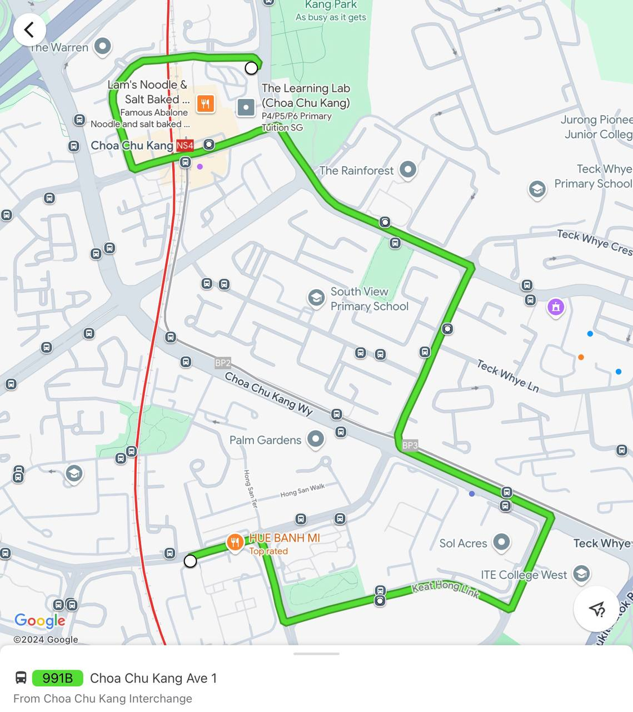
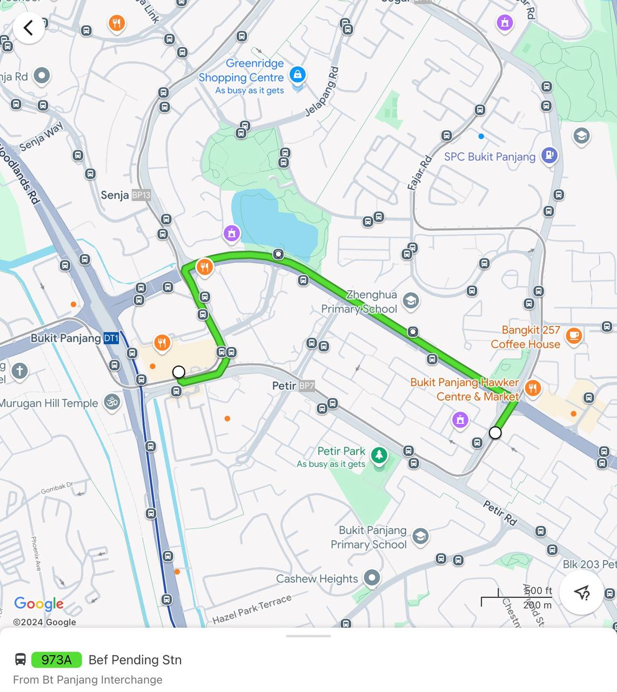
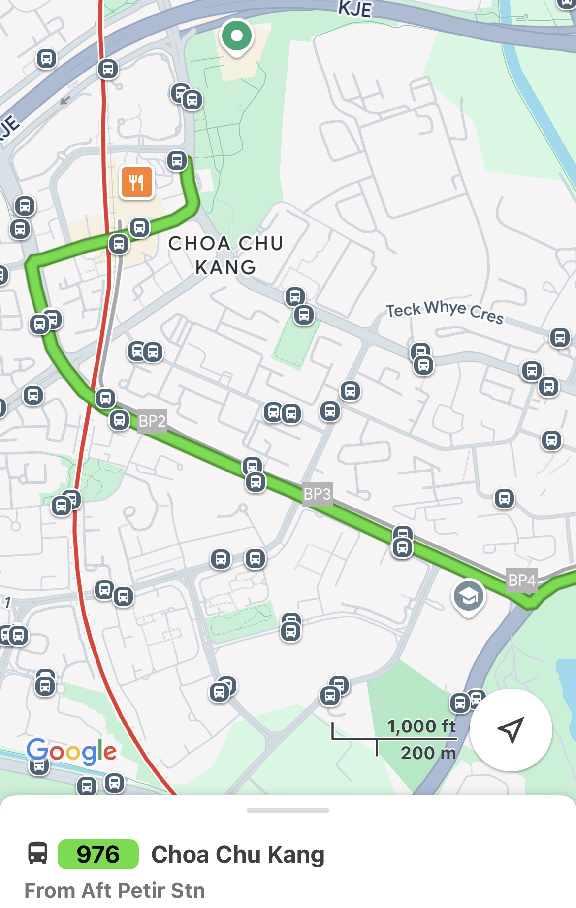
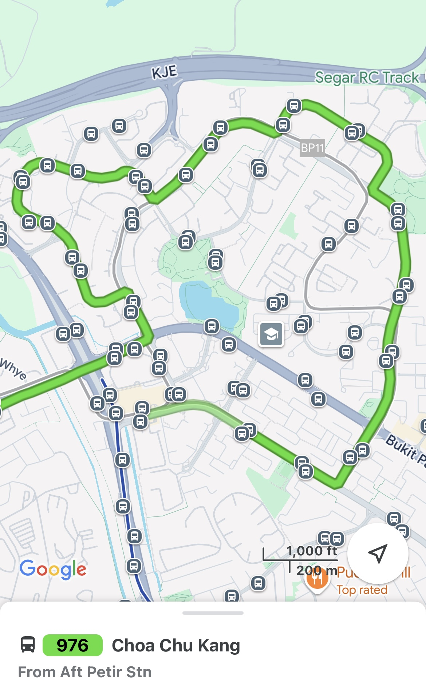

# Technical Report

**Project: Removing Redundant Bus Services**  
**Members: Brandon Ong Cae Jun, Joshua Koh Ze Shao,Kwek Wan Ting, Wong Li Xuan, Xue Beichen**  
Last updated on: 6 Nov 2024

## 1. Context: Why are we doing this?
This project originated from ongoing efforts by LTA, where they rolled out several new MRT lines to make public transportation a more attractive option for commuters, such as the Downtown Line and the Thomson-East Coast line. Prior to these MRT lines, commuters had to rely on several trunk services to get to their destination, which takes longer and is generally less predictable. However, since the launch of the new MRT lines, ridership on these bus services has declined, as observed through small-scale surveys and anecdotal evidence. Therefore, to streamline our public transport options and encourage commuters to use the new MRT lines instead of continuing to rely on the trunk services, the data science department would then need to identify which trunk services (These are the backbone of the public bus network, plying longer routes that take you from one neighbourhood to another, or into the various parts of town.) have significant overlap with MRT lines and should thus be prioritised for consideration.

The goal of this project is therefore to streamline transport options and encourage a greater reliance on MRT lines instead of parallel bus services, thereby improving overall system efficiency. By doing so, we aim to not only improve commuter experiences but also reallocate resources to areas where trunk services are still essential or where demand remains strong. This analysis will ultimately help identify which bus routes may be suitable for rerouting, reduction, or even discontinuation, to align better with current public transit usage patterns and cost-efficiency goals.

---

## 2. Scope: What are we focusing on?
The focus of this report is to identify which trunk services have significant overlap with MRT lines, and determine which bus services route should be either be entirely removed or partially rerouted. This is to better streamline public transportation operations, which would enable us to free up some funding for bus routes which are needed in response to public demand. This will hopefully enhance the overall sustainability and responsiveness of Singapore’s public transport network.

Using openly available data from LTA website and by leveraging on data science and machine learning methods, we can analyze route overlap, identify redundancy patterns, and evaluate alternative routes. This approach will enable a data-driven decision on route optimization, reducing the need for manual assessment and allowing for efficient resource allocation across Singapore’s public transit network. Visualizations will be used to further justify and illustrate our findings. The aim is ultimately to identify the trunk service with greatest overlap with existing MRT lines, so as to achieve efficiency in resource allocation. 

### 2.1 Problem 
The Public Transportation team faces a significant challenge due to the expansion of MRT lines in Singapore. This has decreased the ridership of parallel bus routes. This shift indicates a redundancy in certain trunk bus services, which historically served as primary transport options but are now less utilized due to the MRT's speed and predictability advantages. With limited budgetary resources, there is an urgent need to assess which bus routes overlap significantly with MRT lines and could be discontinued. However, we are also wary, given the example of [bus service 167](https://www.straitstimes.com/singapore/transport/lta-u-turns-on-decision-to-stop-bus-service-167-route-to-be-retained-with-30-minute-intervals) in 2023, which was retained by the LTA with a longer frequency after public objections. Despite running parallel with the newly opened TEL, it provided a vital direct connection (with no multiple transfers) from Northern Singapore to the city.

### 2.2 Success Criteria: What would success look like and how we measure it
Success in this project would involve identifying specific bus routes that overlap significantly with MRT lines and could be optimized for efficiency. This optimization may include complete removal or partial rerouting of these bus services.

Success Measures:
1. Identification of Redundant Routes: Successfully identifying at least 2-3 bus routes with significant overlap with MRT lines that can either be removed or rerouted.
2. Cost Savings and Resource Reallocation: Quantifying the potential cost savings from reducing or rerouting these bus services and demonstrating how these savings could be redirected to fund new or underserved routes. Based on a [ST report](https://www.straitstimes.com/singapore/transport/deficit-for-public-bus-operations-narrows-to-852m-lowest-in-7-years) on 1st November 2024, the shortening of two bus services 75 and 162, which ran parallel to parts of TE line, the termination of 162M and the reduced frequency on bus service 167 had led to an annual cost savings of $5.1 million in total. This exhibits how just cutting a few redundant bus services can lead to substantial cost savings. 
3. Feasibility for Future Expansions: Establishing a replicable methodology that can be applied to future MRT lines, such as the Jurong Region Line, to continuously optimize bus services as the MRT network expands.

This project’s success would be evident if these outcomes are achieved, leading to an improved public transportation framework, optimized resource allocation, and enhanced commuter experience​.

### 2.3 Assumptions
1. Definition of Parallelism: **For each bus service on each route, we measure the parallelism by using the median distance to MRT stations for all the bus stops within the bus route as a proxy.** 
2. Ridership Trends Reflect Declining Usage of Overlapping Bus Services: Based on surveys conducted and anecdotal evidence, we assume that the ridership decline on certain bus routes that run parallel to MRT stations is a direct result of the MRT expansion. 
3. Consistency of Commuter Needs with Identified Overlap: We assume that areas with MRT and bus route overlap do not have additional unmet needs for bus services, and removing or reducing overlapping services will not adversely affect commuter convenience in these regions.
4. Data Limitations and Public Dataset Reliability: We assume that these public datasets will provide a representative picture of ridership patterns, although we acknowledge limitations in data granularity and completeness​ due to the internal bus and MRT ridership datasets not being accessible. 
5. Hypothesis of Overlap and Service Redundancy: We hypothesize that routes showing significant spatial overlap with MRT lines contribute to inefficiencies in the transport network and that reducing or rerouting these services will improve operational efficiency and funding allocation.

---

## 3. Methodology: How are we doing this?

### 3.1. Technical Assumptions
In calculating distance from bus stop to nearest MRT station, we use Euclidean distance to approximate walking distance. However, this approximation may not work in some cases. For example, if there is a large private compound or a canal separating the bus stop from the MRT station, the walking distance would be much larger than the Euclidean distance as a person would have to walk around the compound or canal. Nevertheless, Euclidean distance is a good proxy.

We also thought of the possibility of using manhattan distance as an approximate walking distance as it more accurately maps distances across pavements (pavements are typically parallel or 90 degrees to each other). However, it does not account for the reality of walking diagonally through buildings/parks/etc. Thus, we did not use Manhattan distance. 

We also thought of the possibility of using [Discrete Feachet distance](https://medium.com/tblx-insider/how-long-should-your-dog-leash-be-ba5a4e6891fc) between a bus route and a MRT line. Feachet distance is a metric for the similarity between 2 routes. However, as the solution is unintuitive and difficult to explain to stakeholders, it is less preferred. Furthermore, considering that Euclidean distance is not only intuitive, but also a sufficiently effective tool, we have opted to use Euclidean distance instead.

As we are trying to find bus routes that can be replaced by an MRT line, we assume the time taken to wait for the trains would be sufficiently less than the time taken to wait for the bus service. Unless there is a train breakdown, this assumption generally holds. As MRT breakdowns are rare, with estimates showing that all MRT lines clocked at least 1 million train-km as at end-September 2024, we can proceed with this assumption.

### 3.2. Collecting Data ([Data Preprocessing](https://github.com/brandono7/DSA4264_Geospatial/blob/main/Data%20Prepocessing.ipynb) and [Obtaining Geospatial Data](https://github.com/brandono7/DSA4264_Geospatial/blob/main/get_nearest_mrt_to_bus_stops.ipynb))
The data collection will involve using publicly available datasets from [LTA DataMall](https://datamall.lta.gov.sg/content/datamall/en/dynamic-data.html) to analyze the bus routes that overlap with MRT lines. We will use the LTA Datamall API to extract information on bus service routes (all the bus stops for every bus service route), and passenger volume data (An aggregate number of tap-in and tap-out for each bus stop as well as an aggregate number of tap-in and tap-out data between any two bus stops) from these open datasets. We also extracted passenger volume data for MRT stations (An aggregate number of tap-in and tap-out for each MRT station as well as an aggregate number of tap-in and tap-out data between any two MRT stations). The data that we obtained from LTA DataMall was clean and we did not have to perform heavy data cleaning.

We also made use of the [OneMap API](https://www.onemap.gov.sg/apidocs/) to obtain geospatial data for MRT stations. We downloaded MRT/LRT station codes from static datasets on [LTA DataMall](https://datamall.lta.gov.sg/content/datamall/en/dynamic-data.html). We then obtained the geo-coordinates for the MRT stations by feeding in the station codes into the OneMap API. Given the latitude and longitude of each bus stop (provided in the LTA DataMall API extraction) and each MRT station, we were able to map the Euclidean distance to the nearest MRT station as well as the distance to the nearest MRT on every MRT line (i.e. NS line, EW line, etc.).

We did an ETL process in the **get_nearest_mrt_to_bus_stops.ipynb** file, using the geospatial data of the MRT stations from **data/mrt_stations_with_geo_data.csv** and the geospatial data of the bus stops from **data/Train Station Codes and Chinese Names.xls** to create **processed_data/bus_stops_with_nearest_mrt_data.csv**. In this new csv, we have the bus stop code as the primary key after merging the bus specific datasets from LTA DataMall.

### 3.3. Experimental Design ([Distance-based Algorithm](https://github.com/brandono7/DSA4264_Geospatial/blob/main/Bus%20Algorithm.ipynb)) 
Consider the simple example below to get a sense of how the algorithm works. We have a bus route and a fictional DTL MRT line in this example. For each of the bus stops along this route, we calculate the Euclidean distance to the nearest DTL MRT station. The distances we collect are [10m, 30m, 40m, 20m, 10m]. Therefore the median distance is 20m. The implication is that if a person is at one of the bus stops trying to board the bus, an alternative path for him is to take the DTL line and he is expected to walk an average of 20 meters to and from the MRT station. 


If the median distance is short, ceteris paribus, the bus service is redundant as commuters can just take the DTL line. So, that is the motivation for our project. The question we tackle is, **"Are there any bus routes that has a short median distance to a MRT line?"**

There were several evaluation metrics that we considered regarding the distance to MRT lines: median, mean, and sum. Median was chosen instead of mean to mitigate the impact of outlier distances skewing the mean. We want to get the typical distance a commuter has to walk from bus stop to MRT lines, and not the average distance. 



In the **processed_data/bus_stops_with_nearest_mrt_data.csv** file, for each row, we have the distance of the nearest MRT station for each MRT line and the names of these MRT stations. E.g. We have 1 row of the output data here. The nearest CCL MRT station to the bus stop is Bras Basah MRT and the distance between them is 593 metres.

After the processing of our data, we run the **Bus Algorithm.ipynb** script. In this script, we read in the bus routes data from **data/bus_routes.csv** and the **bus_stops_with_nearest_mrt_data.csv**. It performs the following algorithm to obtain the nearest median distance to each MRT line from every bus stop within a bus route service:

```
hashmap_bus_line = {}
For each bus_line:
    hashmap_mrt_line = {}

    For each mrt_line:
        distances = []

        For each bus_stop in bus_line:
            distance_to_mrt = get_nearest_distance(bus_stop,mrt_line)
            distances.append(distance_to_mrt)
            
        hashmap_mrt_line[mrt_line] = median(distances)
    
    hashmap_bus_line[bus_line] = hashmap_mrt_line
```

This algorithm will result in a hashmap (python dictionary) of hashmaps. Additionally, we also labelled whether a service was a trunk service or feeder bus service using information from [SGWiki](https://sgwiki.com/wiki/Bus_Deployments_by_Service). We then converted it into a csv and stores it in **processed_data/busline_score.csv**. A sample of this csv is below:



For each bus route, we see the median distances to the different MRT lines. The 'nearest_mrt_lrt' column refers to the **median distance to any MRT stations regardless of MRT line** and we use that as our most important metric in determining which bus routes should be made redundant. We did not make use of the other median distances to different train lines as this was not as precise in determining parallelism.

There might be outliers that our distance-based algorithm will not pick up and hence we conduct a further analysis visually to confirm that the bus routes with the one of the shortest median distances from each bus stop is redundant. This further analysis will also help us to check for the aforementioned possible issue that we might encounter in using Euclidean distance metric.

---

## 4. Findings: What did you find?

### 4.1 Results

Based on our distance-based algorithm, we have summarized the bus services that had the smallest median distance to a MRT/LRT line whether it is a trunk or feeder service and whether these bus services have routes that run parallel to MRT lines and where redundancies may exist in the table below: 

| **Bus Service** | **Trunk / Feeder Bus Service** |**Route Parallel to MRT** | **Details** | **Median Distance to MRT line for each Bus Stop (m)** | **Recommend Removal / Reroute**
|--------------|-------------|-------------------------------|-------------|-------------|-------------|
| 384 (Punggol Temp Int ⟲ Blk 413C, 1 ROUTE ∙ 14 STOPS  ) | Feeder |Yes | The route overlaps with the Punggol LRT, covering similar residential areas throughout | 190 | Yes |
| 163A (Sengkang Int → Bef Sengkang West Rd, 1 ROUTE ∙ 17 STOPS ) | Trunk |Yes, but this is an edge case | Runs along the Sengkang LRT's West Loop, particularly through Sengkang E Ave. | 193 | No |
| 374 (Compassvale Int ⟲ Thanggam Stn, 1 ROUTE ∙ 19 STOPS  ) | Feeder | Yes | The route runs parallel to the Sengkang LRT in sections near Anchorvale Link and Fernvale St, covering similar areas to the LRT. | 210 | Yes |
| 991B (Choa Chu Kang Int → Opp Choa Chu Kang Mkt, 1 ROUTE ∙ 6 STOPS  ) | Trunk | Yes (Partial), but this is an edge case | Parallels the North-South MRT Line overall and Bukit Panjang LRT near Keat Hong, but still mostly require some walking distance. | 217 | No |
| 973A (Bt Panjang Int → Bef Pending Stn, 1 ROUTE ∙ 4 STOPS  ) | Trunk | Yes (Partial), but this is an edge case | Closely follows the Bukit Panjang LRT Line, offering some coverage near Petir stations but still mostly require some walking distance. | 220 | No |
| 976 (Choa Chu Kang Int ⇄ Bt Panjang Int, 2 ROUTES ∙ 24 STOPS ∙ 25 STOPS  ) | Trunk |Yes | Closely follows Bukit Panjang LRT | 262 | Yes |

### 4.2 Discussion

The overlap between these bus routes and the MRT lines indicates that some of the bus services may be redundant, particularly in areas where the MRT or LRT provides adequate coverage. 

From a business perspective, removing redundant services or rerouting these bus routes could result in substantial financial savings by reducing fuel consumption, labor costs, and maintenance. These resources could then be redirected to underserved areas, improving efficiency and increasing customer satisfaction in regions with reduced access to transport networks.

### 4.3 Recommendations

- **Bus Service 384**:  


  Due to its redundancy with the Punggol LRT, **we recommend that this bus service should either be removed or revised to service areas not covered by the LRT**.
- **Bus Service 163A**:  

  
  Even though our distance algorithm produces a small value for the median distance, we recognise this was an edge case. We considered the operating hours of both LRT lines and Bus Service 163A. Bus Service 163A is a trunk service that operates daily from 2346 to 0035 while the Sengkang LRT (West Loop) has last trains at 0013 (West Loop Anti-Clockwise) and 0037 (West Loop Clockwise). Since our distance algorithm does not take into account operating hours, this is an edge case as this bus route is important in servicing commuters in the late night. Therefore, **we do not recommend removing this bus service**.
- **Bus Service 374**:  

  
  Due to its redundancy with the Sengkang LRT, **we recommend that this bus service should either be removed or shortened**.
- **Bus Service 991B**:  

  
  Even though our distance algorithm produces a small value for the median distance, we recognise this was an edge case. We considered the operating hours of both Bukit Panjang LRT line, and Bus Service 991B. Bus Service 991B is a trunk service that operates daily from 0017 to 0055 on weekdays and 0018 to 0055 on weekends while the Bukit Panjang LRT from Choa Chu Kang LRT to Petir LRT has last trains at 2337. Since our distance algorithm does not take into account operating hours, this is an edge case as this bus route is important in servicing commuters in the late night. Therefore, Therefore, **we do not recommend removing this bus service**.
  
- **Bus Service 973A**:  

  
  Even though our distance algorithm produces a small value for the median distance, we recognise this was an edge case. We considered the operating hours of both Bukit Panjang LRT line, and Bus Service 973A. Bus Service 973A is a trunk service that operates daily from 0030 to 0110 daily while the Bukit Panjang LRT towards Choa Chu Kang LRT has last trains at 2330. Since our distance algorithm does not take into account operating hours, this is an edge case as this bus route is important in servicing commuters in the late night. Therefore, **we do not recommend removing this bus service**.

- **Bus Service 976**:

<div style="display: flex; gap: 10px;">
    
    
</div>

Closely overlaping with Bukit Panjang LRT along Choa Chu Kang Way and Bukit Panjang Ring Rd, most bus stops serve as a more frequent stop point along the Bukit Panjang LRT. **We recommend that this bus service should either be removed or shortened**.

In our project, the distance algorithm served to be a good proxy for shortlisting bus routes that can be removed and **we identified Bus Service 384, Bus Service 374 and Bus Service 976 to be removed**. We were aware of the potential edge cases that this might have produced and hence we delved deeper visually through map visualisation and considerations of operating hours, which served as the reason why **we did not recommend trunk services like Bus Service 163A, 991B and 973A to be removed**. 

In conclusion, our distance algorithm served as a good first screening criteria for identifying redundant bus services but further research will be needed to definitively determine if a bus service should be removed or rerouted.

### Future Steps:
1. **Passenger Data Analysis**: In the absence of ridership data, these recommendations are based on visual analysis of redundancy. If passenger volume data was more granular and not aggregated, such that we have passenger load data on the number of tap-in and tap-out data for each bus service at every bus stop on the bus route, this would enable us to consider a passenger-volume weighted distance algorithm to provide a clearer picture of where changes will have the most significant impact, where a lower passenger volume on that bus service will penalise that bus service.

2. **Community Feedback**: We hope to gather insights from commuters regarding their travel patterns. Understanding commuter preferences will help optimize routes while maintaining satisfaction.

With better data, we can increase service efficiency and direct resources where they are most needed, leading to overall improved public transportation service.