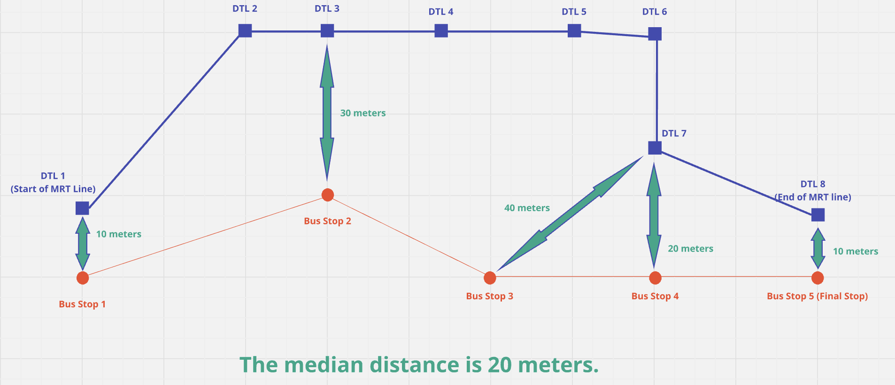

# Technical Report

## 1. Context: Why are we doing this?

In recent years, the Land Transport Authority (LTA) has introduced several new MRT lines, such as the Downtown Line and Thomson-East Coast Line, to improve public transportation efficiency. Historically, commuters relied heavily on bus services, which were slower and less predictable. Since the launch of the new MRT lines, ridership on these bus services has declined, as observed through small-scale surveys and anecdotal evidence. To optimize public transport options and encourage the use of MRT lines, we need to assess which bus routes overlap significantly with MRT services and may be suitable for rerouting or reduction.

Since the opening of these MRT lines, ridership on parallel bus routes has shown a noticeable decline, as evidenced by small-scale surveys and anecdotal feedback. This shift highlights an opportunity to optimize our public transportation network by potentially reducing redundancy where bus services overlap significantly with MRT routes. 

The goal of this project is to streamline transport options and encourage a greater reliance on MRT lines for trunk routes, thereby improving overall system efficiency. By doing so, we aim to not only improve commuter experiences but also reallocate resources to areas where bus services are still essential or where demand remains strong. This analysis will ultimately help identify which bus routes may be suitable for rerouting, reduction, or even discontinuation, to align better with current public transit usage patterns and cost-efficiency goals.

Furthermore, the Ministry of Transport’s Land Division and the Public Transportation team, responsible for strategic planning, have noted that optimizing these services is crucial for maintaining budget constraints. With limited funding available to subsidize both bus and MRT services, it’s imperative to direct resources efficiently. If we do not address this overlap, budget limitations may prevent us from financing other routes that would better serve public needs, especially in underserved areas.

By employing data science in this project, we aim to analyze route overlaps precisely and efficiently, incorporating additional factors such as alternative route availability and potential public response. Success in this endeavor would entail identifying at least 2-3 bus routes that can be modified to free up funding for new, high-demand routes. This will hopefully enhance the overall sustainability and responsiveness of Singapore’s public transport network.

---

## 2. Scope: What are we focusing on?

The focus of this report is to identify bus routes that run parallel to existing MRT lines and assess which routes should be reviewed for potential service changes. The goal is to optimize route planning by reducing redundancy and improving cost-efficiency, while also responding to public demand for new bus services. Specifically, we utilize openly available data from the LTA website to perform analysis and calculations that identify the bus line with the greatest overlap with existing MRT lines. Visualizations will be used to further justify and illustrate our findings.

### 2.1 Problem 
The expansion of new MRT lines in Singapore, including the Downtown Line and Thomson-East Coast Line, has decreased the ridership of parallel bus routes, as observed through small-scale surveys and anecdotal evidence. This shift indicates a redundancy in certain trunk bus services, which historically served as primary transport options but are now less utilized due to the MRT's speed and predictability advantages. With limited budgetary resources, there is an urgent need to assess which bus routes overlap significantly with MRT lines and could be discontinued.

### 2.2 Success Criteria: What would success look like and how we measure it
Success in this project would involve identifying specific bus routes that overlap significantly with MRT lines and could be optimized for efficiency. This optimization may include complete removal or partial rerouting of these bus services. Achieving this would allow for a reallocation of resources to new bus routes that meet emerging public demand, ultimately enhancing the efficiency and responsiveness of Singapore's public transport system.

Success Measures:
1. Identification of Redundant Routes: Successfully identifying at least 2-3 bus routes with significant overlap with MRT lines that can either be removed or rerouted.
2. Cost Savings and Resource Reallocation: Quantifying the potential cost savings from reducing or rerouting these bus services and demonstrating how these savings could be redirected to fund new or underserved routes.
3. Enhanced Commuter Satisfaction: Gauging public satisfaction by tracking feedback and usage patterns on the newly optimized routes, ensuring that changes align with commuter needs and improve their experience.
4. Feasibility for Future Expansions: Establishing a replicable methodology that can be applied to future MRT lines, such as the Jurong Region Line, to continuously optimize bus services as the MRT network expands.

This project’s success would be evident if these outcomes are achieved, leading to an improved public transportation framework, optimized resource allocation, and enhanced commuter experience​

### 2.3 Assumptions
1. Ridership Trends Reflect Declining Usage of Overlapping Bus Services: Based on surveys conducted and anecdotal evidence, we assume that the ridership decline on certain bus routes is a direct result of the MRT expansion.
2. Public Acceptance of Route Changes: We assume that the general public will be receptive to bus route changes, provided there are accessible and reliable MRT alternatives. 
3. Consistency of Commuter Needs with Identified Overlap: We assume that areas with MRT and bus route overlap do not have additional unmet needs for bus services, and removing or reducing overlapping services will not adversely affect commuter convenience in these regions.

---

## 3. Methodology: How are we doing this?

### 3.1. Collecting Data
*Author: Brandon*

The data collection will involve using publicly available datasets to analyze the bus routes that overlap with MRT lines. We will extract information on route paths, timing, and ridership estimates from these open datasets, along with additional information on MRT coverage and the population density of affected areas.

### 3.2. Algorithm Used
Consider the simple example below to get a sense of how the algorithm works. We have a bus line (a bus line or bus route is defined as a given bus service with a direction) and a fictional DTL MRT line in this example. For each of the bus stops along this route, we calculate the euclidean distance to the nearest DTL MRT station. The distances we collect are [10m, 30m, 40m, 20m, 10m]. Therefore the median distance is 20m. The implication is that if a person is at one of the bus stops trying to board the bus, an alternative path for him is to take the DTL line and he is expected to walk an average of 20 meters to and from the MRT station. 



Ceteris Paribus, we can imagine that if the median distance is short, the bus service is redundant as commuters can just take the DTL line. So, that is the motivation for our project. The question we tackle is, **"Are there any bus routes that have a short median distance to a MRT line?"**

Median instead of mean is chosen to avoid the impact of outlier distances. We want to get the typical distance a commuter has to walk, and not the average distance he has to walk. 

First, we did an ETL process in the **get_nearest_mrt_to_bus_stops.ipynb** file, using the geospatial data of the MRT stations from **data/mrt_stations_with_geo_data.csv** and the geospatial data of the bus stops from **data/Train Station Codes and Chinese Names.xls** to create **processed_data/bus_stops_with_nearest_mrt_data.csv**. In this new csv, we have the bus stop code as the primary key. For each row, we have the distance of the nearest MRT station for each MRT line and the names of these MRT stations. E.g. We have 1 row of the output data here. The nearest CCL MRT station to the bus stop is Brash Basah MRT and the distance between them is 593 metres.


After running that script, we run the **Bus Algorithm.ipynb** script. In this script, we read in the bus routes data from **data/bus_routes.csv** and the **bus_stops_with_nearest_mrt_data.csv**. It does the following algorithm:

```
hashmap_bus_line = {}
For each bus_line:
    hashmap_mrt_line = {}

    For each mrt_line:
        distances = []

        For each bus_stop in bus_line:
            distance_to_mrt = get_nearest_distance(bus_stop,mrt_line)
            distances.append(distance_to_mrt)
            
        hashmap_mrt_line[mrt_line] = median(distances)
    
    hashmap_bus_line[bus_line] = hashmap_mrt_line
```

This algorithm will result in a hashmap (python dictionary) of hashmaps. The script then converts it into a csv and stores it in **processed_data/busline_score.csv**. A sample of this csv is below:


For each bus line, we see the median distances to the different MRT lines. The 'nearest_mrt' column refers to the median distance to any MRT stations irregardless of mrt line.


### 3.3. Technical Assumptions
In calculating distance, we use euclidean distance to approximate walking distance. However, this approximation may not work in some cases. For example, if there is a large private compound or a canal separating the bus stop from the MRT station, the walking distance would be much larger than the euclidean distance as a person would have to walk around the compound or canal.

As we are trying to find bus routes that can be replaced by an MRT line, we assume the time taken to wait for the MRT train would be sufficiently less than the time taken to wait for the bus service. Unless there is an MRT breakdown, this assumption generally holds. As MRT breakdowns are rare because LTA is doing a good job, we can proceed with this assumption.

---

## 4. Findings: What did you find?

### 4.1 Results

After analyzing bus routes 163A and 384 along with the previously provided lines, we have summarized whether or not they run parallel to MRT/LRT lines and where redundancies may exist. Here's an updated summary table:

| **Bus Line** | **Route Parallel to MRT/LRT** | **Details** |
|--------------|-------------------------------|-------------|
| 374 (Compassvale Int ⟲ Thanggam Stn, 1 ROUTE ∙ 19 STOPS  ) | Yes | The route runs parallel to the Sengkang LRT in sections near Anchorvale Link and Fernvale St, covering similar areas to the LRT. |
| 973A (Bt Panjang Int → Bef Pending Stn, 1 ROUTE ∙ 4 STOPS  ) | Yes (Partial) | Closely follows the Bukit Panjang LRT Line, offering some coverage near Patir stations but still mostly require some waliking distance. |
| 991B (Choa Chu Kang Int → Opp Choa Chu Kang Mkt, 1 ROUTE ∙ 6 STOPS  ) | Yes (Partial) | Parallels the North-South MRT Line overall and Bukit Panjang LRT near Heat Hong, but still mostly require some waliking distance. |
| 163A (Sengkang Int → Bef Sengkang West Rd, 1 ROUTE ∙ 17 STOPS ) | Yes | Runs along the Sengkang LRT's West Loop, particularly through Sengkang E Ave. |
| 384 (Punggol Temp Int ⟲ Blk 413C, 1 ROUTE ∙ 14 STOPS  ) | Yes | The route overlaps with the Punggol LRT, covering similar residential areas throughout |

### 4.2 Discussion

The overlap between these bus routes and the MRT/LRT lines indicates that some of the bus services may be redundant, particularly in areas where the MRT or LRT provides adequate coverage. 

From a business perspective, removing redundant services or rerouting these bus lines could result in substantial financial savings by reducing fuel consumption, labor costs, and maintenance. These resources could then be redirected to underserved areas, improving efficiency and increasing customer satisfaction in regions with reduced access to transport networks.

### 4.3 Recommendations

- **Bus Route 374**: Strongly consider phasing out or shortening this route due to its overlap with the Sengkang LRT.
- **Bus Route 973A**: Consider reducing the frequency of services or rerouting parts of the journey to areas less covered by Bukit Panjang LRT.
- **Bus Route 991B**: Reroute or reduce frequency since it duplicates North-South MRT coverage in Choa Chu Kang. Efforts should be focused on connecting isolated neighborhoods not directly served by the MRT.
- **Bus Route 163A**: Strongly consider removing as it largely parallels with Sengkang LRT.
- **Bus Route 384**: Due to its redundancy with the Punggol LRT, this bus line should either be removed or revised to service areas not covered by the LRT.


### Future Steps:
1. **Passenger Data Analysis**: Without detailed ridership data, our recommendations are based on visual analysis of redundancy. Having access to passenger load data would provide a clearer picture of where amendments to transport routes will have the most significant impact.

2. **Community Feedback**: Gathering insights from commuters about their travel patterns. Understanding commuter preferences will help optimize bus routes by reducing overlaps with MRT routes, thereby improving efficiency and maintaining commuter satisfaction.

With better data, we can increase service efficiency and direct resources where they are most needed, leading to overall improved public transportation service.


### Screenshots of Visualization:

- **Bus Route 384**:  
  

- **Bus Route 374A**:  
  

- **Bus Route 163A**:  
  

- **Bus Route 973A**:  
  

- **Bus Route 991B**:  
  


