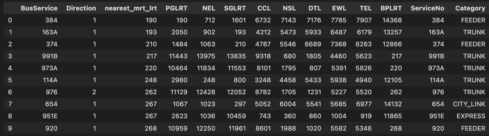

# Technical Report

## 1. Context: Why are we doing this?

In recent years, the Land Transport Authority (LTA) has introduced several new MRT lines, such as the Downtown Line and Thomson-East Coast Line, to improve public transportation efficiency. Historically, commuters relied heavily on bus services, which were slower and less predictable. Since the launch of the new MRT lines, ridership on these bus services has declined, as observed through small-scale surveys and anecdotal evidence. To optimize public transport options and encourage the use of MRT lines, we need to assess which bus routes overlap significantly with MRT services and may be suitable for rerouting or reduction.

---

## 2. Scope: What are we focusing on?

### 2.1. Problem

The focus of this report is to identify bus routes that run parallel to existing MRT lines and assess which routes should be reviewed for potential service changes. The goal is to optimize route planning by reducing redundancy and improving cost-efficiency, while also responding to public demand for new bus services. Specifically, we utilize openly available data from the LTA website to perform analysis and calculations that identify the bus line with the greatest overlap with existing MRT lines. Visualizations will be used to further justify and illustrate our findings.

### 2.2. Success Criteria

### 2.3. Assumptions

---

## 3. Methodology: How are we doing this?

### 3.1. Collecting Data
*Author: Brandon*

The data collection will involve using publicly available datasets to analyze the bus routes that overlap with MRT lines. We will extract information on route paths, timing, and ridership estimates from these open datasets, along with additional information on MRT coverage and the population density of affected areas.

### 3.2. Algorithm Used
Consider the simple example below to get a sense of how the algorithm works. We have a bus line (a bus line or bus route is defined as a given bus service with a direction) and a fictional DTL MRT line in this example. For each of the bus stops along this route, we calculate the euclidean distance to the nearest DTL MRT station. The distances we collect are [10m, 30m, 40m, 20m, 10m]. Therefore the median distance is 20m. The implication is that if a person is at one of the bus stops trying to board the bus, an alternative path for him is to take the DTL line and he is expected to walk an average of 20 meters to and from the MRT station. 


Ceteris Paribus, we can imagine that if the median distance is short, the bus service is redundant as commuters can just take the DTL line. So, that is the motivation for our project. The question we tackle is, **"Are there any bus routes that have a short median distance to a MRT line?"**

Median instead of mean is chosen to avoid the impact of outlier distances. We want to get the typical distance a commuter has to walk, and not the average distance he has to walk. 

First, we did an ETL process in the **get_nearest_mrt_to_bus_stops.ipynb** file, using the geospatial data of the MRT stations from **data/mrt_stations_with_geo_data.csv** and the geospatial data of the bus stops from **data/Train Station Codes and Chinese Names.xls** to create **processed_data/bus_stops_with_nearest_mrt_data.csv**. In this new csv, we have the bus stop code as the primary key. For each row, we have the distance of the nearest MRT station for each MRT line and the names of these MRT stations. E.g. We have 1 row of the output data here. The nearest CCL MRT station to the bus stop is Brash Basah MRT and the distance between them is 593 metres.


After running that script, we run the **Bus Algorithm.ipynb** script. In this script, we read in the bus routes data from **data/bus_routes.csv** and the **bus_stops_with_nearest_mrt_data.csv**. It does the following algorithm:

```
hashmap_bus_line = {}
For each bus_line:
    hashmap_mrt_line = {}

    For each mrt_line:
        distances = []

        For each bus_stop in bus_line:
            distance_to_mrt = get_nearest_distance(bus_stop,mrt_line)
            distances.append(distance_to_mrt)
            
        hashmap_mrt_line[mrt_line] = median(distances)
    
    hashmap_bus_line[bus_line] = hashmap_mrt_line
```

This algorithm will result in a hashmap (python dictionary) of hashmaps. The script then converts it into a csv and stores it in **processed_data/busline_score.csv**. A sample of this csv is below:



For each bus line, we see the median distances to the different MRT lines. The 'nearest_mrt' column refers to the median distance to any MRT stations irregardless of mrt line.


### 3.3. Technical Assumptions
In calculating distance, we use euclidean distance to approximate walking distance. However, this approximation may not work in some cases. For example, if there is a large private compound or a canal separating the bus stop from the MRT station, the walking distance would be much larger than the euclidean distance as a person would have to walk around the compound or canal.

As we are trying to find bus routes that can be replaced by an MRT line, we assume the time taken to wait for the MRT train would be sufficiently less than the time taken to wait for the bus service. Unless there is an MRT breakdown, this assumption generally holds. As MRT breakdowns are rare because LTA is doing a good job, we can proceed with this assumption.

---

## 4. Findings: What did you find?

### 4.1. Results
Remember to put summary table

### 4.2. Discussion

### 4.3. Recommendation
